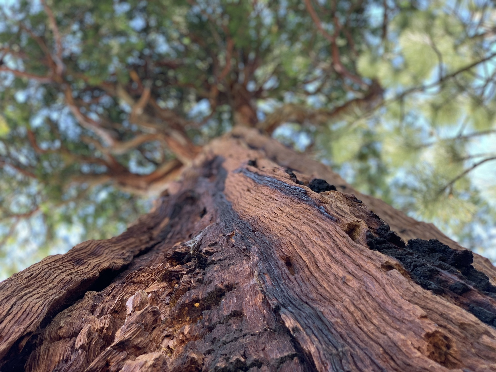

   
  <b> <a href="https://github.com/jbaileyiii">@jbaileyiii</a> holds a 1U structural model. PC: <a href="https://github.com/polygnomial">@polygnomial</a> </b> 
    

# Sequoia — an open source, 3U Imaging CubeSat

Sequoia is a 3U CubeSat that will demonstrate on-board image classification, registration, and processing with updatable machine learning models. The goal of the project is to prove autonomous terrain relative orbit determination and obtain open-source imagery. We will actively retrain Sequoia’s deep learning models using a three camera set-up. The mission architecture is software-defined via image locations, types, and resolutions——Sequoia returns quality imagery. Please contact us about potential launch opportunities.

Welcome! **Joining the Sats team, or new to GitHub?** [Start here.](START_HERE.md)

**[Check out our wiki here](https://ssi-wiki.stanford.edu/Satellites)**

**Interested in learning about the history of the sats team?** Checkout our [webpage.](https://ssi.stanford.edu/teams/satellites)

**Part of SSI?** Check out our [GitHub Project Board.](https://github.com/orgs/stanford-ssi/projects/2)

**Want to chat?** Send an email to <a href="mailto:flynnd@stanford.edu, gregen@stanford.edu">Flynn and Grant</a>

# Subsystem Repositories

**[Avionics](https://github.com/stanford-ssi/sequoia-avionics)** (private)

**[Software](https://github.com/stanford-ssi/sequoia-software)**

- **[GNC](https://github.com/stanford-ssi/sequoia-gnc)**
- **[Simulations](https://github.com/stanford-ssi/sequoia-simulations)** (private)

**[Structures](https://github.com/stanford-ssi/sequoia-structures)** (private)

   
  <b> A tree. Might be a Sequoia, might not. Who knows? PC: <a href="https://github.com/polygnomial">@polygnomial</a> </b> 
    

