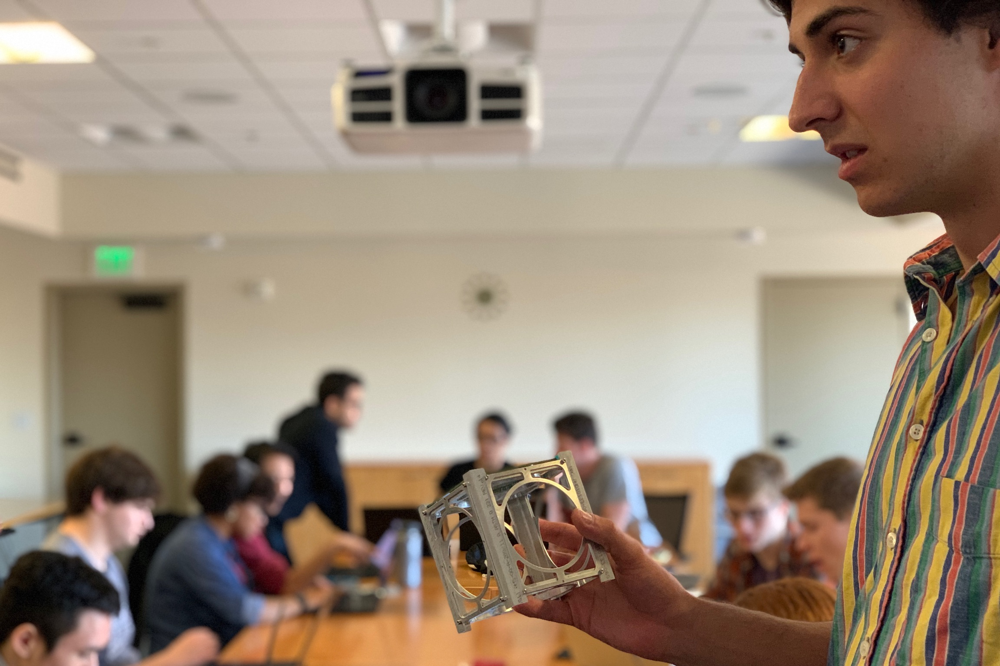

  
  <b> <a href="https://github.com/jbaileyiii">@jbaileyiii</a> holds a 1U structural model. PC: <a href="https://github.com/polygnomial">@polygnomial</a> </b> 
    

# Sequoia — an open source, 3U Imaging CubeSat
Sequoia is our current 3U CubeSat that will demonstrate on-board image classification and processing with updateable machine learning models. The goal of the project is to obtain open-source imagery and prove autonomous orbit determination. We will actively retrain Sequoia’s deep learning models using a three camera set-up. Our mission architecture is software-defined via image locations, types, and resolutions—Sequoia returns quality imagery. We are actively collaborating with IBM Space Tech. Please contact us about potential launch opportunities.

Welcome! **Joining the sats team, or new to GitHub?** [Start here.](START_HERE.md)

**[Check out our wiki here](https://wiki.stanfordssi.org/Satellites)** 

**Interested in learning about the history of the sats team?** Checkout our [webpage.](https://ssi.stanford.edu/teams/satellites)

**Part of SSI?** Check out our [GitHub Project Board.](https://github.com/orgs/stanford-ssi/projects/2) (TODO: update link, fine at the moment)

**Want to chat?** Send an email to [Flynn](mailto:flynnd@stanford.edu) or [Grant](mailto:gregen@stanford.edu).

# Subsystem repositories here:

**[Avionics](https://github.com/stanford-ssi/sequoia-avionics)**

**[Software](https://github.com/stanford-ssi/sequoia-software)**

**[GNC](https://github.com/stanford-ssi/sequoia-gnc)**

**[Structures](https://github.com/stanford-ssi/sequoia-structures)**
